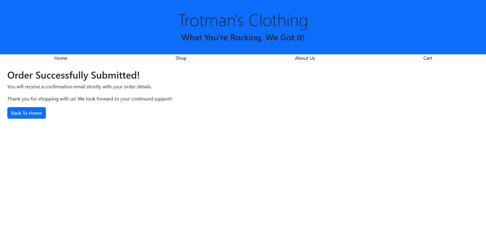

# Trotman Clothing Website

This project emulates a clothing website that allows you to browse for clothing items and add them to a cart for checkout. The website contains a title graphic that will display across every page, as pictured below:


## Home Page


The home page is the initial page that loads when opening the website. This page has a simple image with text underneath, along with a button that takes you to the shop page.

## Shop Page


This Shop page list the 4 different categories of clothing offered on this website: Jeans, T-Shirts, Hoodies, and Accessories.
Clicking a category tile will take you to the next pages showing the articles of clothing for that group. 
These pages will all have a filter button that reveals a dropdown when clicked. 
Here at this dropdown you are able to click different check boxes to filter the article of clothing by size and price.
Each clothing item tile will have the product name, price and size listed, along with an Add To Cart button.
Clicking this tile will also open up a modal that shows two full sized pictures of the product, a description, price, size, and an Add To Cart button. 
An example of this lies below:


### Jeans Page


List of Jeans available on the website.

### T-Shirts Page


List of T-Shirts available on the website.

### Hoodies Page


List of Hoodies available on the website.

### Acessories Page


List of Accessories available on the website.

## About Page


The About page features an accordion dropdown that contains the company mission, frequently asked questions, and contact information.

## Checkout Page



The Checkout page will display the official total of your purchase, including tax and shipping cost. Here you will also fill out a form with your shipping address and payment method. 
Once that is complete, you will hit the submit button to place your order.

## Order Submit Page


The Cart page shows all items that have been added to the cart for potential checkout. Here you're able to see the total price of everything in your cart, as well as increase or decrease the quantity of the item.
Each item will also have a remove button that will clear it from the cart. After everything is to you're liking you can hit the Proceed To Checkout button to bring up the checkout page.

## Order Submit Page


The Order Submit Page displays a message telling you that your order has been successfully submitted, with a Back To Home button that will take you to the website's home page.


This project was generated using [Angular CLI](https://github.com/angular/angular-cli) version 19.1.5.

## Development server

To start a local development server, run:

```bash
ng serve
```

Once the server is running, open your browser and navigate to `http://localhost:4200/`. The application will automatically reload whenever you modify any of the source files.
